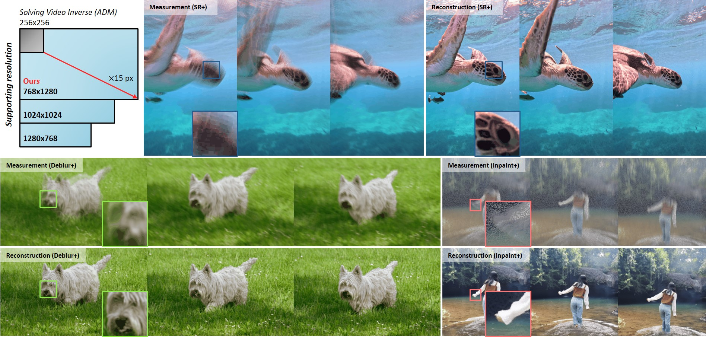

# [ICCV 2025] VISION XL: High Definition Video Inverse Problem Solver using Latent Diffusion Models

This repository is the official implementation of "VISION XL: High Definition Video Inverse Problem Solver using Latent Diffusion Models".
<!-- [](https://arxiv.org/abs/2406.08070v1). -->



[](https://vision-xl.github.io/)
[](https://arxiv.org/abs/2412.00156)

---
## ✨ Summary

We introduce high-definition video inverse problem solver using a state-of-the-art latent diffusion model [SDXL](https://arxiv.org/abs/2307.01952).
Recent approaches enable image diffusion models to solve video inverse problems with significantly reduced computational requirements.
Although effective, these methods have notable drwabacks:

1. **Limited resolution support**
2. **Dependecy on the optical flow estimation**

We propose a novel video inverse problem solver to manage high computational demands of advanced latent diffusion modles with improved temporal consistency. The following advantages are observed

1. **Supports multiple aspect ratios and delivers HD-resolution**
2. **Better temporal consistency**
3. **No requirements on additional modules**

Experimental results confirm that our method significantly enhances performance in **solving high-definition video inverse problems**, suggesting a new standared for efficiency and flexibility.

## 🗓 News
- **[16 Jan 2025]** Code released.
- **[29 Nov 2024]** Paper uploaded.


## 🔥 Setup
First, create your environment. We recommend using the following comments. 

```
git clone https://github.com/vision-xl/codes.git
cd vision-xl/codes
conda env create -f environment.yaml
```

For reproducibility, using the same package version is necessary since some dependencies lead to significant differences (for instance, diffusers).
Diffusers will automatically download checkpoints for SDXL.


## 🚀 Examples

### High-definition video inverse problem solver

- Landscape (764x1280) video reconstruction sample

```
SAMPLE_FLAGS="--method vision-xl --degradation +deblur --ratio 0.6 --folder_path examples/assets/pexels_sample/landscape"
python -m examples.video_recon $SAMPLE_FLAGS
```
- Vertical (1280x764) video reconstruction sample

```
SAMPLE_FLAGS="--method vision-xl --degradation +deblur --ratio 1.67 --folder_path examples/assets/pexels_sample/vertical"
python -m examples.video_recon $SAMPLE_FLAGS
```
- Square (1024x1024) video reconstruction sample

```
SAMPLE_FLAGS="--method vision-xl --degradation +deblur --ratio 1.0 --folder_path examples/assets/pexels_sample/square"
python -m examples.video_recon $SAMPLE_FLAGS
```
  - For the other degradations, run above with ```--degradation "degradation type"```. We support wide range of degradation types, such as +deblur, +sr, +inpaint, deblur, sr, and inpaint.


> [!tip]
> If you want to use different ratio, change ```--ratio``` as supporting ratio defined in "SD_XL_BASE_RATIOS" of 'examples/video_recon.py'.


## 📝 Citation
If you find our method useful, please cite our paper and leave a star to this repository :)

```
@article{kwon2024vision,
  title={VISION-XL: High Definition Video Inverse Problem Solver using Latent Image Diffusion Models},
  author={Kwon, Taesung and Ye, Jong Chul},
  journal={arXiv preprint arXiv:2412.00156},
  year={2024}
}
```

> [!note]
> This repository build from official repository of [CFG++]((https://arxiv.org/abs/2406.08070v1)).
